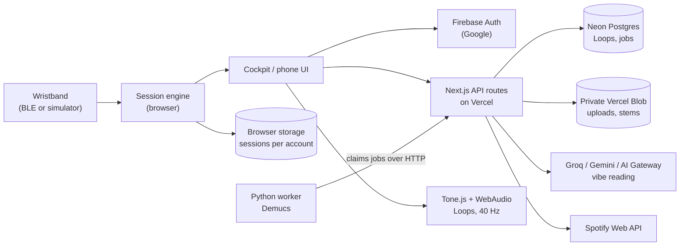

# StudyLoop — Product Brief & PRD

> A study wristband and session app that shows how your body responds while you learn, and plays focus
> audio that adapts to it.

_Version 0.3 · 3 October 2026 · Live at https://study-loop-alpha.vercel.app · Branch `feature/study-music-stems`_

Related: [`PROJECT_BRIEF.md`](./PROJECT_BRIEF.md) · [`MUSIC.md`](./MUSIC.md) · [`DESIGN.md`](./DESIGN.md)

**Status key:** **Live** deployed to production · **Built** on the branch, not yet deployed · **Backend** server
side exists, no UI · **Planned** in the brief, not started · **Open** a decision is needed

---

# Part A · The product today

## A1 · Overview

StudyLoop pairs a wristband with a web app. You start a study session, the band captures a short baseline of
your heart rate and skin conductance, and the app tracks how those signals move against that baseline while you
work. Music that adapts to your stress state plays alongside: original, lyric-free beats in the style of a
Spotify playlist you choose, or 40 Hz beats. When the session ends you get a breakdown in Insights.

The project brief goes further than what is built: EEG headphones that read brainwaves, audio chosen by
brainwave band, a strict mode that blocks distracting apps, and group study. Those are product direction and are
covered as requirements in Part B. Today the app runs end to end with a simulated band, and can pair a real band
over Web Bluetooth.

## A2 · How a session works

1. **Connect.** Pair the band from the top bar or Profile. Optional: without a band, a session runs as a plain
   timer. A simulated band is available for testing.
2. **Baseline.** 20 seconds of stillness. StudyLoop records your resting heart rate and skin conductance for the
   day.
3. **Study.** Timer, live heart rate and EDA, and a state read against baseline: stable, changing, elevated,
   recovering. Mark moments; pause; play a Loop or 40 Hz beats.
4. **Review.** Insights shows time stable, elevated moments, your marks and the EDA trace for each session.

Setup lets you choose subject, topic, length (5 to 180 minutes) and mode (Deep work, Review, Practice). If a
session starts with nothing playing, StudyLoop offers to open your music. If the page reloads mid-session, a
prompt offers to continue it, save it or discard it.

## A3 · Feature inventory

| Area | What it does | Status |
| --- | --- | --- |
| Sign-in | Google sign-in through Firebase Auth. The whole app requires an account. Profile photo defaults to the Google photo and can be replaced. | Live |
| Cockpit (desktop) | One-screen dashboard: hero, heart rate, EDA, signal quality, baseline, session player, 5-minute signal trend, research card, dock with Home, Session, Insights, Research, Music, Profile. | Live |
| Phone layout | A separate vertical composition with the same data and a bottom sheet for each tab. | Live |
| Band pairing | "Pair your band" connects a simulated SL-01 with live heart rate, EDA and battery, marked Simulated. "Use a real band" pairs over Web Bluetooth in Chrome and Edge. | Live |
| Sessions without a band | Start a timer-only session; signals show as offline. | Live |
| Physiological state | Classifies heart rate and EDA against the session baseline into stable, changing, elevated, recovering, poor signal or none. Never shown as a focus or stress score. | Live |
| Insights | Per-session summary: minutes, share of time stable, elevated moments, marks, EDA chart against baseline. A labelled sample session shows until you have your own. | Live |
| Sessions survive reloads | Live and finished sessions are saved per account in the browser. After a crash or reload: "Your app crashed while playing a session. Do you want to continue?" with Continue, End & save, Discard. | Built |
| Loops (music) | Paste a Spotify playlist; an AI model reads its style; the browser plays original lyric-free beats in that style that slow and soften when you're stressed. Save, rename, replay and remove Loops. | Live |
| 40 Hz session beats | A button in session controls: binaural 200/240 Hz on headphones plus a pulsed tone for speakers. Asks before pausing a playing Loop, with a "don't ask again" option. | Built |
| Music prompt at start | "Hey, we see you're not listening to any Loop." Yes opens Music; No; Don't ask me again. | Built |
| Stem separation | Upload a song you own; a Python worker (Demucs) splits it into No Lyrics, Vocals Only and Beats Only. Private per user, cached, crash-safe queue. | Backend |
| Research tab | Theta, alpha, gamma and 40 Hz explained with hedged copy, an oscilloscope visual and three peer-reviewed papers per band (12 DOIs checked against Crossref). | Live |
| Quiet mode | Dims everything except timer and state, and hides the landing story below the first screen. | Live |
| Colour palettes | Four palettes in Profile (see A6), applied before first paint, saved per browser. | Built |
| Intro | The wordmark writes itself in GitHub's Mona Sans, sinks into a warm status light that stretches and splits the screen, then a skeleton of the layout hands off to the real cards. Full film once per visit; repeat loads at 4×. | Live |
| Landing story | Scroll sections below the cockpit: product story, band anatomy, frequencies, the study loop flow, finale. | Live |
| EEG headphones | Brainwave reading and band-driven audio choice. | Planned |
| Strict mode | Blocks distracting apps for the session. | Planned |
| Group study | Study together as a class or with friends. | Planned |

"Built" items are commits `01cfcf9`, `7f111ab` and `7dfaa2b`. Production currently runs commit `e22eafb`; the last
deploy attempt failed with "Not authorized" from the Vercel CLI.

## A4 · Music system

### Loops: beats in a playlist's style (Live)

- Spotify no longer gives new apps tempo, key or energy, so a model reads the playlist's titles and artists:
  Groq `gpt-oss-120b` first, then Gemini, then the Vercel AI Gateway. Output is validated with a schema and
  cached per track list.
- Tone.js renders chords, bass, plucked arpeggios, a sparse lead and drums (lo-fi, dholak groove, boom-bap,
  downtempo, ambient) entirely in the browser. No song audio is used.
- Under stress the beat slows (tempo ×0.82), drums drop to 30%, the tone darkens and space opens up, gliding
  over 6 seconds.
- Playlists need "Connect Spotify" (PKCE, token kept only in the tab). The Spotify app owner needs Premium.

### Stem separation (Backend)

- Upload to a private Vercel Blob store; a job is queued in Neon Postgres.
- A Python worker anywhere (laptop, VM, GPU box) claims jobs over HTTP, runs Demucs and uploads six outputs.
- About 0.5 to 1× song length per job on CPU; 156 s for a 2:33 song live. Heartbeats every 10 s; stalled jobs
  are requeued.
- The library UI was removed when Loops replaced it; the API and worker remain.

## A5 · Architecture

| Layer | Choice |
| --- | --- |
| App | Next.js 16 App Router, React 19, TypeScript, hosted on Vercel (Node runtime) |
| Motion | GSAP with ScrollTrigger, Lenis smooth scroll, Motion for React, thinking-orbs for dot-matrix orbs |
| Audio | Tone.js for Loops, raw WebAudio for 40 Hz beats |
| Data | Neon Postgres (serverless driver), private Vercel Blob with presigned single-use links |
| Identity | Firebase Auth (project `study-loop-abecd`); every server query is scoped by the verified uid |
| AI | AI SDK 7 with Groq, Google and AI Gateway providers; Zod-validated structured output |
| Tests | Vitest (app, API, prompts, persistence, palettes) and Python unittest for the worker |

## A6 · Design system

The cockpit follows an L-shaped wireframe: a main panel with notches carved for the status capsule and the
metric cards, and a floating dock. Type pairs a wide display face (ASTROZ, with Michroma standing in), Satoshi
for UI and Instrument Serif for editorial lines; the intro uses GitHub's Mona Sans. Colour follows the 60-30-10
rule on a warm near-black, with desaturated accents so nothing glows like neon on black. One colour always means
measured data; the other means actions and research.

| Palette | Measured | Action | Notes |
| --- | --- | --- | --- |
| Collegiate track | `#9DBA8E` infield sage | `#CF4F33` cinder brick | Default |
| Calypso & gold | `#7FB0C8` harbour blue | `#D9A441` varsity gold | |
| Berry & sand | `#D2BE9A` dune sand | `#C24E68` crew berry | Bone text on action |
| Race day | `#D7FF3A` volt | `#FF5A1F` blaze | Loud on purpose |

All palettes sit on warm carbon (`#12110F`) with bone text (`#ECE6D9`). Palettes are defined once in
`src/lib/palettes.ts`.

## A7 · Claims policy

**StudyLoop is a study tool, not a medical device.** It measures heart rate and skin conductance. It never shows
focus scores, stress scores or brain readings, and does not diagnose or treat anything.

Research content is labelled experimental, uses the action colour, and stays visually separate from measured
data. Copy is hedged: "associated with", "explored", "investigated".

---

# Part B · Product requirements

## B1 · Problem

- Studying is full of distraction: phones, social apps, streaming.
- Lyrical music competes with reading and remembering; the words pull attention.
- Students only know how long they sat down, not how their body responded or when they drifted.

StudyLoop's bet: if students can see how their body responds while they study, and hear audio that responds to
it, they will study in longer, steadier sessions and come back to review them.

## B2 · Users

- **Solo studier.** A secondary-school or university student revising alone for 30 to 90 minutes, usually with
  music. Wants to stay on task and see whether a session went well.
- **Study group.** Friends or a class who study at the same time and want to keep each other going. Need sharing
  without exposing sensitive body data.
- **Music-first studier.** Won't give up their playlist. Will accept a lyric-free version of its sound.
- **Demo audience.** Judges, investors and testers without hardware. Needs the simulator and a sample session to
  understand the product in two minutes.

## B3 · Goals & non-goals

**Goals**

- A session anyone can start in under 10 seconds, with or without the band.
- Body signals shown relative to the person's own baseline, never as a score.
- Focus audio that is lyric-free, personal to the listener's taste, and adapts to their state.
- Session history that is never lost to a reload, crash or device change.
- Science presented honestly: experimental claims labelled, sources linked.

**Non-goals**

- Diagnosing stress, anxiety, ADHD or any condition.
- Focus, productivity or "brain" scores.
- Streaming or redistributing Spotify audio.
- A general-purpose fitness tracker.

## B4 · Requirements

P0 is required for a public beta, P1 for v1.0, P2 later.

### Sessions & signals

| ID | Requirement | Pri | Status |
| --- | --- | --- | --- |
| S-1 | Start, pause, resume, mark and end a session with subject, topic, length and mode. | P0 | Live |
| S-2 | Capture a 20-second baseline when a band is connected; restart it if interrupted. | P0 | Live |
| S-3 | Run a timer-only session with no band. | P0 | Live |
| S-4 | Classify state against baseline (stable, changing, elevated, recovering) and log elevated moments. | P0 | Live |
| S-5 | Survive reloads and crashes: offer Continue, End & save, or Discard; lose at most 3 seconds. | P0 | Built |
| S-6 | Sync session history to the account so it follows the person across devices. | P0 | Planned |
| S-7 | Simulated band for demos and testing, clearly marked as simulated. | P1 | Live |
| S-8 | Trends across sessions in Insights (week view, time of day, subject). | P1 | Planned |

### Hardware

| ID | Requirement | Pri | Status |
| --- | --- | --- | --- |
| H-1 | Define the band's BLE protocol (heart rate, EDA or SpO₂, battery, button) and pair it from the app. | P0 | Built (app side) |
| H-2 | Settle the sensor list (MAX30102 PPG vs. EDA electrodes) and make the website match it. | P0 | Open |
| H-3 | Signal quality shown live, with guidance when contact is poor. | P1 | Live |
| H-4 | EEG headphones: read brainwave bands during a session and play the focus audio. | P2 | Planned |

### Focus audio

| ID | Requirement | Pri | Status |
| --- | --- | --- | --- |
| M-1 | Create a Loop from a Spotify playlist: original lyric-free beats in its style. | P0 | Live |
| M-2 | Loops adapt to state: slower, sparser and darker when elevated, back on recovery. | P0 | Live |
| M-3 | Save, rename, replay and remove Loops per account. | P1 | Live |
| M-4 | Offer music when a session starts with none playing; respect "don't ask again". | P1 | Built |
| M-5 | 40 Hz beats in session; one soundtrack at a time, asking before pausing a Loop. | P1 | Built |
| M-6 | A fuller beats system: alpha and theta options, volume, and a choice driven by the session's state. | P1 | Planned |
| M-7 | Lyric-free versions of songs the person owns (stem separation) with a UI. | P2 | Backend |

### Focus environment & social

| ID | Requirement | Pri | Status |
| --- | --- | --- | --- |
| E-1 | Quiet mode: dim everything but timer and state; stay on the first screen. | P1 | Live |
| E-2 | Colour palettes and display preferences. | P2 | Built |
| E-3 | Strict mode on phones: block chosen apps for the session (needs a native app). | P1 | Planned |
| E-4 | Group study rooms: see who is studying and for how long; never share raw body data by default. | P1 | Planned |

### Trust

| ID | Requirement | Pri | Status |
| --- | --- | --- | --- |
| T-1 | Google sign-in; all user data scoped to the verified account. | P0 | Live |
| T-2 | Consent before collecting body data; export and delete my data. | P0 | Planned |
| T-3 | Research shown as experimental, with peer-reviewed sources per band. | P1 | Live |

## B5 · Non-functional requirements

| Area | Requirement |
| --- | --- |
| Reliability | No session data lost on reload or crash; at most 3 seconds of a live session. Music jobs survive worker crashes (heartbeat and requeue). |
| Performance | Cockpit interactive within 3 seconds on a mid-range laptop; intro skippable at any time; animations hold 60 fps and pause in quiet mode. |
| Privacy | Body data is sensitive personal data. Store the minimum, encrypt in transit and at rest, keep uploads private, log ids and timings only, never titles, tokens or audio. |
| Accessibility | Keyboard reachable; visible focus; respects reduced motion; text contrast at WCAG AA in every palette. |
| Platforms | Chrome and Edge for real band pairing (Web Bluetooth); every modern browser for everything else; phone layout from 360 px. |
| Compliance | Copy stays clear of medical claims. Spotify use stays within its developer terms: metadata only, no audio. |

## B6 · Success metrics

Definitions are set; targets are to be set from the first beta cohort.

| Metric | Definition | Why it matters |
| --- | --- | --- |
| Session completion | Sessions ended at or past their planned length ÷ sessions started | The core promise: steadier, longer study |
| Weekly studiers | Accounts with 2 or more sessions in a week | Habit, not novelty |
| Time stable | Median share of session time in the stable state, per person over time | Whether people settle in better with use |
| Audio adoption | Sessions with a Loop or 40 Hz beats playing for more than half the session | Whether adaptive audio earns its place |
| Review rate | Sessions whose Insights page is opened within 24 hours | Whether the analysis is useful |
| Recovery accepted | "Continue session" choices ÷ recovery prompts shown | Whether crash recovery actually saves sessions |

## B7 · Risks & open questions

| Risk | Detail | Next step |
| --- | --- | --- |
| Sensor mismatch | The brief lists MAX30102 (PPG, SpO₂) and EEG headphones; the site says heart rate and skin conductance and "does not read brain activity". | Decide the v1 sensor list; update copy, the band drawing and the BLE spec together. |
| Science claims | Evidence for 40 Hz improving focus is early and mixed; a 2023 study failed to replicate the mouse results. Alpha's link to attention is correlational. | Keep "explored, not proven" framing; never imply treatment. |
| Delta while studying | Delta is mainly associated with deep sleep. | Decide whether it is ever played during study; likely drop it. |
| Spotify terms | Spotify's terms forbid downloading or modifying its audio; the app owner needs Premium; dev-mode apps are limited to listed users. | Stay metadata-only; apply for extended quota before launch. |
| Strict mode | iOS app blocking needs Apple's FamilyControls entitlement; Android needs accessibility or device-admin permissions. | Scope a native companion app; apply for the entitlement early. |
| Data on one browser | Sessions are saved per account but only in one browser today. | Ship server-side sync (S-6) before beta. |
| Deploy access | The last production deploy failed with "Not authorized". | Re-authenticate the Vercel CLI; consider Git-based deploys from main. |

## B8 · Milestones

| Milestone | Scope | Exit criteria |
| --- | --- | --- |
| **M0 · Prototype** (done) | Cockpit, phone layout, simulated band, sessions, Insights, Loops, research, intro. | End-to-end demo with no hardware. |
| **M1 · Beta ready** | Deploy the built work; server-side session sync; consent and data controls; settle the sensor list and copy; merge the branch to main. | 10 to 20 students use it for two weeks with no lost sessions. |
| **M2 · Real band** | Firmware and BLE protocol; pairing, battery and signal quality from real hardware; baseline tuned on real data. | A full session on the real band matches the simulator's experience. |
| **M3 · Study together** | Group rooms, shared timers, privacy rules for what classmates see; a fuller beats system. | Groups run weekly sessions; no raw body data shared without opt-in. |
| **M4 · Focus environment** | Native companion app with strict mode; EEG headphone exploration. | Strict mode approved on iOS and Android. |
